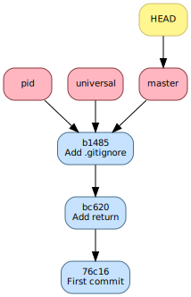
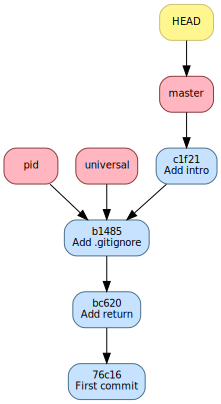

.. -*- coding: utf-8 -*-
.. Copyright |copy| 2019 by Benoit Legat et Mathieu Jadin
.. Ce fichier est dérivé de `Outils Git
    <https://github.com/obonaventure/SystemesInformatiques/blob/master/Outils/git.rst>`_
   by Benoit Legat, used under `creative commons <http://creativecommons.org/licenses/by-sa/3.0/>`_
.. Ce fichier est distribué sous une licence `creative commons <http://creativecommons.org/licenses/by-sa/3.0/>`_

.. _non_linear_history:

Branching
~~~~~~~~~

Lorsqu'on exécute ``git init``, une branche au nom de ``master`` est créée.
Beaucoup de petits projets se contentent de cette branche et n'en font pas
d'autre mais c'est passer à côté d'un des aspects les plus pratiques de `Git`_.

Une utilisation classique des branches sont les *feature branches*.
C'est à dire qu'on a la branche principale ``master`` qui contient un code
de toutes les fonctionnalités terminées.
Quand on essaie d'ajouter une
fonctionnalité (*feature* en anglais), on crée une nouvelle branche qu'on
ne fusionne avec ``master`` que lorsque le code est terminé.
Ça permet de pouvoir implémenter plusieurs fonctionnalités en parallèle sans
être gêné par l'instabilité du code créé par les fonctionnalités
en développement.
Ceci est encore plus vrai quand on travaille à plusieurs sur un même code
et sur les même fonctionnalités.

Par exemple, supposons que vous soyez à 2 à travailler sur un projet.
L'un travaille sur une fonctionnalité, l'autre sur une autre.
À la base, le code sans ces deux fonctionnalités marchait mais comme
vous êtes en train d'en implémenter une nouvelle chacun, le code ne marche
chez aucun des deux développeurs.

`Git`_ peut créer un historique non-linéaire semblable à celui ci-dessous.
C'est un exemple un peu exagéré de non-linéarité mais il est
pédagogiquement intéressant.

Cet historique forme un graphe orienté,
c'est à dire que les arêtes ont une direction.

Les noeuds sont de 3 types.

- en bleu, on a les commits;
- en rouge, on a les branches, le nom est un peu trompeur car
  c'est juste un pointeur vers un commit;
- en jaune, on a ``HEAD``, c'est un pointeur vers la branche active.

   Exemple d'historique avec plusieurs branches

Créer une branche
#################

Pour créer une branche, on utilise la commande `git-branch(1)`_.
`git-branch(1)`_ sert aussi à montrer la liste des branches avec
le caractère ``*`` devant la branche active.

Par exemple, supposons qu'on veuille ajouter à notre exemple la possibilité
de changer le message un caractère plus universel pour que le programme soit
utilisable pour tout citoyen de l'univers.
Mais qu'on veut aussi ajouter un aspect pratique en rajoutant le pid
du processus et du processus parent.

On commencera par créer deux *feature branches*, ``pid`` et ``universal``.
On supprime la branche ``hello`` qui servait juste à montrer qu'elle ne bougeait
pas quand on committait car ce n'était pas la branche active.

.. code-block:: bash

   $ git branch
     hello
   * master
   $ git branch pid
   $ git branch universal
   $ git branch -d hello
   Deleted branch hello (was 76c1677).
   $ git branch
   * master
     pid
     universal

L'historique ressemble maintenant à la figure suivante.
On voit que `git-branch(1)`_ ne modifie pas la branche active.

   Historique après la création de ``pid`` et ``universal`` et
   la suppression de ``hello``

On va d'ailleurs finalement committer notre commentaire en début de fichier
dans ``master``. On obtient alors la figure suivante

.. code-block:: bash

   $ git s
   # On branch master
   # Changes not staged for commit:
   #   (use "git add <file>..." to update what will be committed)
   #   (use "git checkout -- <file>..." to discard changes in working directory)
   #
   #	modified:   main.c
   #
   no changes added to commit (use "git add" and/or "git commit -a")
   $ git commit -a -m "Add intro"
   [master c1f2163] Add intro
    1 file changed, 4 insertions(+)

   Historique après avoir ajouté un commentaire d'introduction

Changer la branche active
#########################

On va maintenant voir comment changer la branche active,
c'est à dire la branche vers laquelle ``HEAD`` pointe.
Pour faire cela, on utilise `git-checkout(1)`_.

.. code-block:: bash

   $ git checkout pid
   Switched to branch 'pid'
   $ git branch
     master
   * pid
     universal

`git-checkout(1)`_ ne fait pas que changer la branche active, il modifie
aussi le *working directory* pour refléter le commit référencé par la nouvelle
branche active.
Après le *checkout*, le contenu de ``main.c`` vaut

.. code-block:: c

   // includes
   #include <stdio.h>
   #include <stdlib.h>

   // main function
   int main () {
     printf("Hello world!\n");
     return EXIT_SUCCESS;
   }

S'il y a des fichiers modifiés au moment du `git-checkout(1)`_,
`Git`_ va faire du mieux qu'il peut pour changer de branche en gardant
vos modifications mais si le fichier modifié est justement un fichier
qui diffère entre l'ancienne branche active et la nouvelle branche active,
`Git`_ va abandonner le changement de branche car mettre ce fichier à
la version de la nouvelle branche écraserait les modifications.

Les changements doivent alors soit être committés,
soit sauvegardés par `git-stash(1)`_ (détailllé plus loin),
soit abandonnés.
Pour abandonner des changements et revenir à la version du commit référencé
par la branche active, on utilise aussi `git-checkout(1)`_.
Avec `Git`_, pas mal de commandes ont de multiples usages.

Dans notre exemple, si on change ``main.c``, cela pose problème car il
diffère entre ``master`` et ``pid`` mais
si on change ``.gitignore``, ça n'en pose pas.
Il nous montre d'ailleurs que ``.gitignore`` a des modifications et qu'il
les a laissées lorsqu'on exécute ``git checkout master``

.. code-block:: bash

   $ echo "42" >> main.c
   $ echo "42" >> .gitignore
   $ git checkout master
   error: Your local changes to the following files would be overwritten by checkout:
       main.c
   Please, commit your changes or stash them before you can switch branches.
   Aborting
   $ git checkout main.c
   $ git checkout master
   M	.gitignore
   Switched to branch 'master'
   $ git checkout .gitignore # Retirons ce "42", c'était juste pour l'exemple

.. inginious:: git_branches

Fusionner des branches
######################

Lorsqu'on fusionne deux branches,
le rôle de chaque branche n'est pas le même.
Il y a la branche active et la branche qu'on veut fusionner.
Par la règle *il n'y a toujours que la branche active qui est modifée*,
on sait que la branche qu'on veut fusionner ne va pas bouger.
Le but de la fusion, c'est de déplacer la branche active vers un commit
contenant les modifications faites par le commit référencé par la branche
active ainsi que celles faites par celui référencé par la branche qu'on veut
fusionner.
Par "modification", j'entends, les modifications faites depuis le premier
commit parent commun entre les deux commits en question.
Deux cas peuvent se présenter

- soit ce commit parent est le commit référencé par la branche active,
  dans lequel cas, on dira que la fusion est *fast-forward*.
  `Git`_ fera alors simplement la branche active pointer vers le commit
  référencé par la branche qu'on veut fusionner;
- soit ce commit parent est le commit référencé par la branche qu'on veut
  fusionner, dans lequel cas, `Git`_ ne fera rien car le commit référencé
  par la branche active contient déjà les modifications de l'autre puisque
  c'est un de ses commits parents;
- soit ce commit est différent des deux commits en question.
  Dans ce cas, `Git`_ créera un commit ayant deux parents, les deux commits
  en questions et tentera de fusionner toutes les modifications depuis
  le commit parent commun.
  Bien entendu, plus ce commit commun est loin, plus il y aura de modification
  et plus ce sera difficile.
  C'est pourquoi on conseille de souvent fusionner la branche principale
  pour éviter que la fusion de la *feature branch* soit trop compliquée
  lorsque la fonctionnalité sera terminée.

  Là encore, il y a deux cas

  - soit `Git`_ arrive à tout fusionner, c'est à dire que les modifications
    sont soit dans des fichiers différents, soit à des endroits bien
    distincts d'un même fichier;
  - soit il n'y arrive pas. Il fusionnera alors le plus possible lui-même
    et marquera dans le fichier les confits à gérer à la main.
    Il faudra alors ouvrir le fichier et régler puis avertir à `Git`_
    qu'il peut terminer la fusion.
    En peut aussi dire qu'on abandonne la fusion et `Git`_ retire tout
    ce qu'il a fait pour la fusion.

  Dans les deux cas, si on abandonne pas, `Git`_ créera ce commit
  de fusion et fera pointer la branche active vers ce dernier.

Il est important de ré-insister sur le fait que
la branche non-active n'a pas été modifiée par la fusion.
Par contre si on la rend active et
qu'on demande de la fusionner avec l'ancienne branche active,
ce sera nécessairement une fusion *fast-forward*.

`git-merge(1)`_ s'occupe de fusionner les branches
(fusionner se dit *merge* en anglais),
on lui donne en argument la branche à fusionner et la branche active est
bien entendu celle référencée par ``HEAD`` qui a été définie par
les appels à `git-checkout(1)`_.

Dans notre exemple, on peut faire avancer ``pid`` et ``universal`` au niveau
de ``master`` avec une fusion *fast-forward*.

.. code-block:: bash

   $ git checkout pid
   Switched to branch 'pid'
   $ git merge master
   Updating b14855e..c1f2163
   Fast-forward
    main.c | 4 ++++
    1 file changed, 4 insertions(+)
   $ git checkout universal
   Switched to branch 'universal'
   $ git merge master
   Updating b14855e..c1f2163
   Fast-forward
    main.c | 4 ++++
    1 file changed, 4 insertions(+)

On a alors la figure suivante

   Historique après avoir mis ``pid`` et ``universal`` à jour

Commençons maintenant à développer notre compatibilité
avec le reste de l'univers.
On va rajouter une option ``--alien`` qui transforme le ``Hello world!``
en ``Hello universe!``

.. code-block:: diff

   $ git diff
   diff --git a/main.c b/main.c
   index 8381ce0..8ccfa11 100644
   --- a/main.c
   +++ b/main.c
   @@ -5,9 +5,14 @@
    // includes
    #include <stdio.h>
    #include <stdlib.h>
   +#include <string.h>

    // main function
   -int main () {
   -  printf("Hello world!\n");
   +int main (int argc, char *argv[]) {
   +  if (strncmp(argv[1], "--alien", 8) == 0) {
   +    printf("Hello universe!\n");
   +  } else {
   +    printf("Hello world!\n");
   +  }
      return EXIT_SUCCESS;
    }

Mettons tous les changements des fichiers traqués avec ``-a``

.. code-block:: bash

   $ git commit -a -m "Make it universal"
   [universal 6c743f6] Make it universal
    1 file changed, 7 insertions(+), 1 deletion(-)

Ce qui donne l'historique suivant

   Historique après avoir committé ``Make it universal``

On va maintenant ajouter un ``Makefile`` qui compile puis exécute le programme
lorsqu'on écrit ``make``.
Comme un ``Makefile`` exécute la première règle, il suffit de mettre la règle
qui exécute en premier

.. code-block:: makefile

   run: a.out
           ./a.out
   a.out: main.c
           gcc main.c

Ainsi, à chaque fois qu'on exécute la commande ``make``, la règle ``run``
sera exécutée mais avant, ses dépendances donc ``a.out`` sera exécutée
si la date de modification de ``main.c``
est plus récente que celle de ``a.out``.
Committons cela

.. code-block:: bash

   $ git checkout master
   Switched to branch 'master'
   $ git status
   # On branch master
   # Untracked files:
   #   (use "git add <file>..." to include in what will be committed)
   #
   #	Makefile
   nothing added to commit but untracked files present (use "git add" to track)
   $ git add Makefile
   $ git commit -m "Add Makefile"
   [master c35a8c3] Add Makefile
    1 file changed, 5 insertions(+)
    create mode 100644 Makefile

   Historique après avoir committé ``Add Makefile``

On voit ici que pour ``pid``,
fusionner ``master`` est *fast-forward* et pas pour *universal*.
C'est ce qu'on va vérifier

.. code-block:: bash

   $ git checkout universal
   Switched to branch 'universal'
   $ git merge master
   Merge made by the 'recursive' strategy.
    Makefile | 5 +++++
    1 file changed, 5 insertions(+)
    create mode 100644 Makefile

On voit que `Git`_ a su faire la fusion sans notre aide sans problème
car tous les changements étaient dans le ``Makefile`` qui n'existait pas
pour ``universal``

   Historique après avoir fusionné ``master`` dans ``universal``

.. code-block:: bash

   $ git checkout pid
   Switched to branch 'pid'
   $ git merge master
   Updating c1f2163..c35a8c3
   Fast-forward
    Makefile | 5 +++++
    1 file changed, 5 insertions(+)
    create mode 100644 Makefile

`Git`_ nous confirme que c'est *fast-forward*

.. figure:: figures/hello_pid_makefile.svg
   :align: center

   Historique après avoir fusionné ``master`` dans ``pid``

Tant qu'on est sur la branche ``pid``,
implémentons la fonctionnalité comme suit

.. code-block:: diff

   $ git diff
   diff --git a/main.c b/main.c
   index 8381ce0..b9043af 100644
   --- a/main.c
   +++ b/main.c
   @@ -5,9 +5,11 @@
    // includes
    #include <stdio.h>
    #include <stdlib.h>
   +#include <unistd.h>

    // main function
    int main () {
   +  printf("pid: %u, ppid: %u\n", getpid(), getppid());
      printf("Hello world!\n");
      return EXIT_SUCCESS;
    }

et committons la

.. code-block:: bash

   $ git commit -a -m "Add pid/ppid info"
   [pid eda36d7] Add pid/ppid info
    1 file changed, 2 insertions(+)

   Historique après avoir implémenté ``pid``

On peut maintenant fusionner ``pid`` dans master et la supprimer car on
en a plus besoin

.. code-block:: bash

   $ git checkout master
   Switched to branch 'master'
   $ git merge pid
   Updating c35a8c3..eda36d7
   Fast-forward
    main.c | 2 ++
    1 file changed, 2 insertions(+)
   $ git branch -d pid
   Deleted branch pid (was eda36d7).

   Historique après avoir fusionné et supprimé ``pid``

Retournons sur notre branche ``universal`` et essayons notre ``Makefile``

.. code-block:: bash

   $ git checkout universal
   Switched to branch 'universal'
   $ make
   gcc main.c
   ./a.out
   make: *** [run] Segmentation fault (core dumped)

Les deux premières lignes sont simplement les commandes que `make(1)`_ exécute.
La troisième est plus inquiètante.
Elle nous avertit que le programme a été terminé par le signal ``SIGSEV``.
C'est dû au fait qu'on ne vérifie pas que ``argv`` ait au moins 2 éléments
avant d'essayer accéder au deuxième élément.

.. code-block:: diff

   $ git diff
   diff --git a/main.c b/main.c
   index 8ccfa11..f90b795 100644
   --- a/main.c
   +++ b/main.c
   @@ -9,7 +9,7 @@

    // main function
    int main (int argc, char *argv[]) {
   -  if (strncmp(argv[1], "--alien", 8) == 0) {
   +  if (argc > 1 && strncmp(argv[1], "--alien", 8) == 0) {
        printf("Hello universe!\n");
      } else {
        printf("Hello world!\n");

Ça marche maintenant sans *Segmentation fault*

.. code-block:: bash

   $ make
   gcc main.c
   $ ./a.out
   Hello world!
   $ ./a.out --alien
   Hello universe!
   $ git commit -a -m "Fix SIGSEV without args"
   [universal 6fd2e9b] Fix SIGSEV without args
    1 file changed, 1 insertion(+), 1 deletion(-)

   Historique après avoir réparé le ``Segmentation fault``

``universal`` est maintenant prêt à être mergée.

.. code-block:: bash

   $ git checkout master
   Switched to branch 'master'
   $ git merge universal
   Auto-merging main.c
   CONFLICT (content): Merge conflict in main.c
   Automatic merge failed; fix conflicts and then commit the result.

Les conflits sont marqués dans ``main.c``

.. code-block:: c

   /*
    * Print 'Hello world!'
    */

   // includes
   #include <stdio.h>
   #include <stdlib.h>
   <<<<<<< HEAD
   #include <unistd.h>

   // main function
   int main () {
     printf("pid: %u, ppid: %u\n", getpid(), getppid());
     printf("Hello world!\n");
   =======
   #include <string.h>

   // main function
   int main (int argc, char *argv[]) {
     if (argc > 1 && strncmp(argv[1], "--alien", 8) == 0) {
       printf("Hello universe!\n");
     } else {
       printf("Hello world!\n");
     }
   >>>>>>> universal
     return EXIT_SUCCESS;
   }

Il nous faut maintenant éditer ``main.c`` pour résoudre le conflit.
Il n'y a un conflit à un seul endroit du fichier mais le conflit est assez
large, `Git`_ nous montre ce qu'il y a pour ``HEAD`` c'est à dire
la branche active ``master`` et ce qu'il y a pour ``universal``.
On va devoir prendre un peu des deux.

Si on fait `git-diff(1)`_ par la suite, `Git`_ met en début de ligne un
``+`` ou un ``-`` en premier caractère
si c'est une ligne qui vient de la branche qu'on veut fusionner,
en deuxième caractère si ça vient de la branche active et en premier et
deuxième caractère si ça vient d'aucune des deux pour le ``+``.

.. code-block:: diff

   $ git diff
   diff --cc main.c
   index b9043af,f90b795..0000000
   --- a/main.c
   +++ b/main.c
   @@@ -5,11 -5,14 +5,17 @@@
     // includes
     #include <stdio.h>
     #include <stdlib.h>
    +#include <unistd.h>
   + #include <string.h>

     // main function
   - int main () {
   + int main (int argc, char *argv[]) {
    +  printf("pid: %u, ppid: %u\n", getpid(), getppid());
   -   printf("Hello world!\n");
   ++
   +   if (argc > 1 && strncmp(argv[1], "--alien", 8) == 0) {
   +     printf("Hello universe!\n");
   +   } else {
   +     printf("Hello world!\n");
   +   }
       return EXIT_SUCCESS;
     }

Il n'y a pas besoin de spécifier de commentaire pour une fusion car
`Git`_ en génère un automatiquement

.. code-block:: bash

   $ git commit -a
   [master 0dd6cd7] Merge branch 'universal'

   Historique après avoir fusionné la branche ``universal``

On voit que la branche ``universal`` est restée à sa place car ce n'était
pas la branche active.
On peut d'ailleurs maintenant la supprimer

.. code-block:: bash

   $ git branch -d
   Deleted branch universal (was 6fd2e9b).

.. inginious:: git-branch-merge
