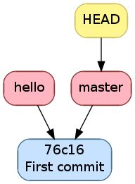
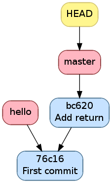
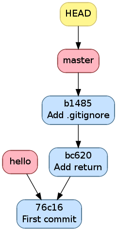

.. -*- coding: utf-8 -*-
.. Copyright |copy| 2013 by Benoit Legat
.. Ce fichier est distribué sous une licence `creative commons <http://creativecommons.org/licenses/by-sa/3.0/>`_

Manipulation de l'historique à travers les commandes Git
~~~~~~~~~~~~~~~~~~~~~~~~~~~~~~~~~~~~~~~~~~~~~~~~~~~~~~~~

Pour initialiser un dépôt `Git`_,
il suffit d'utiliser la commande `git-init(1)`_

.. code-block:: bash

   $ git init
   Initialized empty Git repository in /path/to/project/.git/

À ce moment, l'historique est vide.

Staging area
############

Commençons par définir les 4 statuts qu'un fichier peut avoir
 - il peut être non-traqué par `Git`_, c'est à dire qu'il n'est
   ni dans le *git directory*, ni dans la *staging area*.
   C'est un fichier que le autres développeurs peuvent ne même pas être
   au courant que vous l'avez dans votre *working directory*.
   C'est souvent le cas des fichiers qui sont générés automatiquement,
   et dont leur changement n'a donc aucun intérêt à être suivit.
   Dans le cas d'un projet en C,
   on aura les fichiers résultant de la compilation comme les fichiers objets
   ``*.o``;
 - il peut être non-modifié, c'est à dire que son état dans le
   *working directory* est le même que celui dans le *git directory* au
   commit actif (référencé par la branche active,
   celle référencée par ``HEAD``) ainsi que celui dans la *staging area*
   s'il y est;
 - il peut être modifié, c'est à dire que sont état est différent dans le
   *working directory* que celui dans le *git directory* au commit actif
   ainsi que celui dans la *staging area* si il y est.
 - il peut être *staged*, c'est à dire qu'il est dans la *staging area*

Par exemple, prenons un fichier non-modifié.
Après des modifications, il a le statut modifié.
Si on le place dans la *staging area*, il acquière le statut *staged*.
Si on le modifie à nouveau, il aura le statut modifié mais
son état avec uniquement les premières modifications aura le statut *staged*.

Pour obtenir l'information sur le statut de tous les fichiers,
utilisez `git-status(1)`_

.. code-block:: bash

   $ git status
   # On branch master
   # Changes to be committed:
   #   (use "git reset HEAD <file>..." to unstage)
   #
   #	modified:   main.c
   #	new file:   file.c
   #
   # Changes not staged for commit:
   #   (use "git add <file>..." to update what will be committed)
   #   (use "git checkout -- <file>..." to discard changes in working directory)
   #
   #    modified:   main.c
   #	modified:   Makefile
   #
   # Untracked files:
   #   (use "git add <file>..." to include in what will be committed)
   #
   #	main.o
   #	file.o
   #	a.out

Dans la partie ``Changes to be committed``,
on a les fichiers au statut *staged*.
Dans la partie ``Changes not staged for commit``,
on a les fichiers au statut modifié.
Les fichiers au statut non-modifié ne sont pas affichés et ceux non-trackés
sont dans la partie ``Untracked files`` sauf si on a spécifiquement demandé
de les ignorer dans le fichier ``.gitignore``.
En effet, on peut s'imaginer que dans un gros projet, la partie
``Untracked files`` peut devenir assez imposante et on ne sait plus
distinguer les fichiers qu'il faut penser à ajouter de ceux qu'il faut
ignorer une fois de plus.

Lorsque `Git`_ voit un fichier ``.gitignore`` dans un dossier,
il en prend compte pour tous ses fichiers ainsi que tous les fichiers des
sous-dossiers.
La syntaxe est très simple, on spécifie un fichier par ligne,
on utilise un ``*`` pour spécifier n'importe
quelle chaine de charactères, les commentaires commencent par un ``#``
comme en Bash et si la ligne commence par un ``!``,
on demande de ne pas ignorer ce fichier à l'intérieur du dossier même
si un ``.gitignore`` d'un dossier parent dit le contraire.
Dans notre exemple, ``.gitignore`` aura le contenu suivant

.. code-block:: bash

   # Object files
   *.o
   # Executable
   a.out

.. inginious:: git-gitignore

Pour faire passer un fichier du statut modifié au status *staged*,
il faut utiliser `git-add(1)`_.
Lorsqu'on lui donne en argument un fichier modifié, elle ajoute sa version
avec toutes les modifications dans la *staging area*.
Si on lui donne un dossier,
elle ajoute tous les fichiers au statut modifié ou
au statut non-traqué qui ne sont pas ignoré par `Git`_.

.. code-block:: bash

   $ git add .

On peut aussi donner l'option ``-p`` à `git-add(1)`_,
`Git`_ demandera alors pour chaque bloc de modification s'il faut le prendre
en compte puis ajoutera dans la *staging area* un fichier avec toutes
ces modifications.
C'est très utile si on a fait différents changements dans un fichier mais
qu'on ne veut pas tout committer ou qu'on veut les séparer en différents
commits parce qu'ils font des choses différentes.
Par exemple, si j'ai un fichier ``main.c`` dans lequel j'ai rajouté
un ``return EXIT_SUCCESS;`` et un commentaire en début de fichier
mais que je n'ai envie que de faire passer le ``return EXIT_SUCCESS;``
dans la *staging area*, il me suffit de faire

.. code-block:: diff

   $ git add -p main.c
   diff --git a/main.c b/main.c
   index 7402a78..8381ce0 100644
   --- a/main.c
   +++ b/main.c
   @@ -1,3 +1,7 @@
   +/*
   + * Print 'Hello world!'
   + */
   +
    // includes
    #include <stdio.h>
    #include <stdlib.h>
   Stage this hunk [y,n,q,a,d,/,j,J,g,e,?]? n
   @@ -5,4 +9,5 @@
    // main function
    int main () {
      printf("Hello world!\n");
   +  return EXIT_SUCCESS;
    }
   Stage this hunk [y,n,q,a,d,/,K,g,e,?]? y

On peut aussi faire retirer des fichier de la *staging area* avec la commande
`git-reset(1)`_.
``git reset`` les retire tous,
``git reset main.c`` retire uniquement ``main.c`` et on a à nouveau
l'option ``-p`` pour ne sélectionner qu'une partie.
Par exemple, si dans l'exemple précédent j'avais mis ``main.c`` entièrement
dans la *staging area* mais que je veux comme précédemment uniquement
mettre le ``return EXIT_SUCCESS;``, je peux soit faire ``git reset main.c``
et puis faire ``git add -p main.c`` comme tout à l'heure, soit faire

.. code-block:: diff

   $ git reset -p main.c
   diff --git a/main.c b/main.c
   index 7402a78..8381ce0 100644
   --- a/main.c
   +++ b/main.c
   @@ -1,3 +1,7 @@
   +/*
   + * Print 'Hello world!'
   + */
   +
    // includes
    #include <stdio.h>
    #include <stdlib.h>
   Unstage this hunk [y,n,q,a,d,/,j,J,g,e,?]? y
   @@ -5,4 +9,5 @@
    // main function
    int main () {
      printf("Hello world!\n");
   +  return EXIT_SUCCESS;
    }
   Unstage this hunk [y,n,q,a,d,/,K,g,e,?]? n

Avant d'utiliser `git-add(1)`_ et `git-reset(1)`_,
il est utile de vérifier plus précisément ce qu'on a changé dans
les fichiers que `git-status(1)`_ nous dit qu'on a modifié.
C'est une des utilités de la commande `git-diff(1)`_.
Par défaut, elle calcule les changements entre le *working directory*
et la *staging area*, mais on peut aussi lui demander de regarder les
changements entre deux commits.
Si on ne lui dit rien, elle donne les changements de tous les fichiers mais
on peut lui demander de se limiter à un fichier ou à un dossier spécifique.
Dans notre exemple,

.. code-block:: diff

   $ git diff main.c
   diff --git a/main.c b/main.c
   index 07e26bf..8381ce0 100644
   --- a/main.c
   +++ b/main.c
   @@ -1,3 +1,7 @@
   +/*
   + * Print 'Hello world!'
   + */
   +
    // includes
    #include <stdio.h>
    #include <stdlib.h>

On peut aussi lui demander de générer un patch,
c'est à dire un fichier qui contient les informations nécessaires pour
appliquer ce changement chez un autre développeur.
Ce n'est pas la manière la plus pratique de se partager les changements
comme on verra avec les *remotes* mais c'est utilisé.

Commit
######

Voyons à présent comment committer
les fichiers présents dans la *staging area*.
Comme vu précédemment,
il y a toujours un commit actif,
c'est comparativement à ce dernier que `Git`_ détermine si un fichier est
modifié ou pas.

Lorqu'on choisit de committer ce qu'il y a dans la *staging area*,
un nouveau commit est créé avec le même état que le précédent plus les
modifications des fichiers au statut *staged*.
Ce nouveau commit a une référence vers le commit précédent.
La branche active change alors de référence et pointe alors vers le nouveau
commit.
Aucune autre branche ne bouge, même celle qui référençait l'ancien commit.
On peut retenir qu'*il n'y a toujours que la branche active qui est modifée*.

Dans notre exemple,
l'historique était comme l'image ci-dessous

   Historique avant le commit

.. code-block:: bash

   $ git commit -m "Add return"
   [master 6e2f599] Add return
    1 file changed, 1 insertion(+)

Après le commit, il est comme l'image ci-dessous.
On voit que la branche active a avancé alors que les autres n'ont pas bougé.

   Historique après le commit

Lorsqu'on fait ``gcc main.c`` un fichier ``a.out`` est généré.
Il est inutile de suivre ses changements à travers `Git`_ car ses modifications
ne sont que l'image des modifications de ``main.c``.
De plus, ce n'est pas un fichier texte donc `Git`_ ne verra pas ce qui
a changé, il fera comme si tout ``a.out`` avait changé.

.. code-block:: bash

   $ echo "a.out" > .gitignore
   $ git status
   # On branch master
   # Changes not staged for commit:
   #   (use "git add <file>..." to update what will be committed)
   #   (use "git checkout -- <file>..." to discard changes in working directory)
   #
   #	modified:   main.c
   #
   # Untracked files:
   #   (use "git add <file>..." to include in what will be committed)
   #
   #	.gitignore
   no changes added to commit (use "git add" and/or "git commit -a")
   $ git add .gitignore
   $ git commit -m "Add .gitignore"
   [master b14855e] Add .gitignore
    1 file changed, 1 insertion(+)
    create mode 100644 .gitignore

   Historique l'ajout de .gitignore

Souvent, on a envie de committer tous les fichiers au statut *modifié*.
Si on fait ``git add .``, on ajoutera aussi tous les fichiers non-traqués
qui ne sont pas ignorés, c'est à dire ceux affichés par ``git status``
en dessous de ``Untracked files``.
Si ça pose problème, on peut utiliser l'option ``-a`` de `git-commit(1)`_
qui inclut tous les fichiers au statut *modifié* en plus de ceux dans la
*staging area* pour le commit.
On verra des exemples d'utilisation par après.
