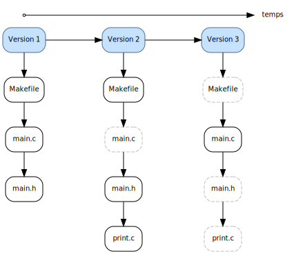

.. -*- coding: utf-8 -*-
.. Copyright |copy| 2019 by Benoit Legat et Mathieu Jadin
.. Ce fichier est dérivé de `Outils Git
    <https://github.com/obonaventure/SystemesInformatiques/blob/master/Outils/git.rst>`_
   by Benoit Legat, used under `creative commons <http://creativecommons.org/licenses/by-sa/3.0/>`_
.. Ce fichier est distribué sous une licence `creative commons <http://creativecommons.org/licenses/by-sa/3.0/>`_

Introduction
~~~~~~~~~~~~

`Git`_ a été développé initialement pour la gestion du code source du kernel Linux.
Il est aussi utilisé pour la gestion des sources de ce document
depuis https://github.com/obonaventure/SystemesInformatiques.
On l'utilise le plus souvent à l'aide de l'utilitaire `git(1)`_ mais il
existe aussi des
`applications graphiques <http://git-scm.com/downloads/guis>`_.

Les différentes versions des fichiers sont enregistrées dans des commits.
Chaque commit est lié aux commits précédents
qui consituent la version précédente comme dans l'image ci-dessous.
On sait ainsi facilement voir ce qui a changé entre deux versions
(pas spécialement, une version et la suivante)
et même restaurer l'état de certains fichiers à une version sauvegardée
dans un commit.

   L'historique Git

Dans cet exemple, lors du premier commit, un Makefile et
les fichiers main.c et main.h ont été ajoutés.
Le deuxième commit a rajouté le fichier print.c
et modifié les autres fichiers à l'exception de main.c.
Ce dernier est modifié dans le dernier commit.
Du coup, si vous utilisez `Git`_ pour un projet, vous ne pouvez jamais
perdre plus que les changements que vous n'avez pas encore commit.
Toutes les versions du codes déjà commit sont sauvegardées et facilement
accessibles.
Cette garantie est extrêmement précieuse et constitue à elle seule une raison
suffisante d'utiliser `Git`_ pour tous vos projets.

Contrairement à `subversion`_, il est décentralisé, c'est à dire que chaque
développeur a toute l'information nécessaire pour utiliser `Git`_,
il ne doit pas passer par un serveur où les données sont centralisées à
chaque commande.
Cela prend éventuellement plus d'espace disque mais comme on travaille
avec des documents de type texte, ce n'est pas critique.
Les avantages, par contre, sont nombreux.
On a pas besoin d'être connecté au serveur pour l'utiliser,
il est beaucoup plus rapide
et chaque développeur constitue un backup du code, ce qui est confortable.

De plus, comme on va le voir, `Git`_ supporte une gestion des commits
très flexible avec un historique pas linéaire
mais composés de plusieurs branches et il
permet aux développeurs de ne pas avoir toutes les branches en local.

Cette efficacité de `Git`_ et sa flexibilité sont ses arguments majeurs et
leur origine est évidente quand on sait qu'il a été créé pour gérer des projets
aussi complexes que le kernel Linux.
Il est parfois critiqué pour sa complexité mais c'est surtout dû au fait
qu'il a une façon assez différente de fonctionner des autres.
