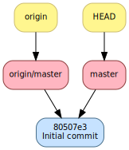

.. -*- coding: utf-8 -*-
.. Copyright |copy| 2019 by Benoit Legat et Mathieu Jadin
.. Ce fichier est dérivé de `Outils Git
    <https://github.com/obonaventure/SystemesInformatiques/blob/master/Outils/git.rst>`_
   by Benoit Legat, used under `creative commons <http://creativecommons.org/licenses/by-sa/3.0/>`_
.. Ce fichier est distribué sous une licence `creative commons <http://creativecommons.org/licenses/by-sa/3.0/>`_

Utilisation basique de Git
~~~~~~~~~~~~~~~~~~~~~~~~~~

Créer et mettre à jour un historique
####################################

La forme la plus simple d'historique est une chaîne de versions.
Chaque version étend la précédente en ajoutant, supprimant ou modifiant
des fichiers.
La section :ref:`non_linear_history` montrera comment (et pourquoi) utiliser
plusieurs chaînes de versions dans un seul repository.

Avec `Git`_, on appelle une version un *commit*.
Chacun de ces commits est documenté en fournissant le nom de l'auteur,
son email, un commentaire et une description détaillée optionnelle.
Pour ne pas devoir re-spécifier le nom et l'email à chaque fois,
on le stocke dans le fichier de configuration de `Git`_ ``~/.gitconfig``.
Bien qu'on peut l'éditer manuellement, on préfère le faire à l'aide de
la commande `git-config(1)`_.

.. note::
   Voici les commandes à exécuter pour configurer le nom, l'email et l'éditeur
   de texte.
   Vous devez bien entendu remplacer les valeurs par celles qui vous conviennent.

   .. code-block:: console

      $ git config --global user.name "Jean Dupont"
      $ git config --global user.email jean@dupont.com
      $ git config --global core.editor gedit

   L'option ``--global`` spécifie qu'on veut que ces configurations s'appliquent
   pour tous nos dépôts (`Git`_ éditera le fichier ``~/.gitconfig``).
   Sinon, `git-config(1)`_ ne modifie que le fichier
   ``.git/config`` à l'intérieur du *git directory* du projet en cours.
   Ce dernier prône bien entendu sur ``.git/config`` quand une variable
   a des valeurs différentes dans ``~/.gitconfig`` et ``.git/config``.

Pour ajouter un nouveau commit (i.e., une nouvelle version), il faut marquer
les fichiers que vous voulez sauvegarder dans ce commit.

Il y a 4 états dans lequel un fichier peut être,
 - il peut être *non tracké*,
   si le fichier n'est pas dans la *staging area* ou dans le dernier commit;
 - il peut être dans le *modifié*,
   c'est à dire que c'est le fichier diffère la version dans la *staging area*;
 - il peut être *staged* ou *to be committed*,
   c'est à dire qu'il se trouve dans la *staging area*
   et qu'il sera pris en compte dans le prochain commit;
 - et il peut être *comitted*, c'est à dire sauvegardé dans
   le dernier commit à l'intérieur du dossier ``.git``.

   Les 4 états possibles d'un fichier

Pour committer des fichiers, non trackés ou modifiés, on les met d'abord dans la
*staging area* puis on commit tous les fichiers à l'intérieur.
Cette flexibilité permet d'éviter de toujours commit
tous les changements du *working directory*.
Notez qu'il est possible de faire retirer des fichiers de la staging area
ou de l'historique lui-même. C'est couvert dans la Section :ref:`rollback_changes`.

Voyons tout ça avec un programme exemple qui affiche en LaTex
la somme des entiers de :math:`1` à :math:`n`.
On va utiliser les commandes

- `git-init(1)`_ qui permet de transformer un projet en dépôt `Git`_
  (tout est stocké dans le dossier ``.git``);
- `git-diff(1)`_ qui donne la différence entre l'état des fichiers dans le
  *working directory* avec leur état dans le *git directory*
  au commit actuel;
- `git-status(1)`_ qui affiche les fichiers modifiés et ceux qui seront
  dans le prochain commit;
- `git-add(1)`_ qui spécifie quels changements doivent faire partie
  du prochain commit en les ajoutant à la *staging area*;
- `git-commit(1)`_ qui commit les fichiers dans la *staging area*;
- et `git-log(1)`_ qui montre tous les commits de l'historique.

La première version sera la suivante

.. code-block:: c

   #include <stdio.h>
   #include <stdlib.h>

   int main (int argc, char *argv[]) {
     long int sum = 0, i, n = 42;
     for (i = 1; i <= n; i++) {
       sum += i;
     }
     printf("\\sum_{i=1}^{ %ld } i = %ld\n", n, sum);
     return EXIT_SUCCESS;
   }

Ce programme fonctionne comme suit

.. code-block:: console

   $ gcc main.c
   $ ./a.out
   \sum_{i=1}^{42} i = 903

On va sauvegarder un premier commit contenant cette version de ``main.c``

.. code-block:: console

   $ git init
   Initialized empty Git repository in /path/to/project/.git/

`git-init(1)`_ permet d'initialiser le dépôt `Git`_.

.. code-block:: console

   $ git status
   # On branch master
   #
   # Initial commit
   #
   # Untracked files:
   #   (use "git add <file>..." to include in what will be committed)
   #
   #	main.c
   nothing added to commit but untracked files present (use "git add" to track)

`git-status(1)`_ analyse le contenu du répertoire.
Il indique que le fichier ``main.c`` n'est pas tracké par `Git`_ (`untracked`).

.. code-block:: console

   $ git add main.c
   $ git status
   # On branch master
   #
   # Initial commit
   #
   # Changes to be committed:
   #   (use "git rm --cached <file>..." to unstage)
   #
   #	new file:   main.c
   #

Ce fichier est ajouté à la staging area avec la commande `git-add(1)`_.

.. code-block:: console

   $ git commit -m "First commit"
   [master (root-commit) 3d18efe] First commit
    1 file changed, 11 insertions(+)
    create mode 100644 main.c
   $ git log
   commit 3d18efe4df441ebe7eb2b8d0b78832a3861dc05f
   Author: Benoît Legat <benoit.legat@gmail.com>
   Date:   Sun Aug 25 15:32:42 2013 +0200

       First commit

`git-commit(1)`_ sauvegarde la version du code de la staging area dans un commit
dont le commentaire, spécifié avec l'option ``-m``, est *First commit*.
L'historique est affiché avec la command `git-log(1)`_.

Modifions maintenant le programme pour qu'il prenne la valeur de
:math:`n` dans ``argv``.
Si on compile le programme après modification, et qu'on exécute avec
en argument :math:`10` puis :math:`9.75`, on obtient ce qui suit.

.. code-block:: console

   $ gcc main.c
   $ ./a.out 10
   \sum_{i=1}^{10} i = 55
   $ ./a.out 9.75
   $ echo $?
   1

On peut maintenant voir avec `git-status(1)`_ que le fichier ``main.c``
a été modifié.

.. code-block:: console

   $ git status
   # On branch master
   # Changes not staged for commit:
   #   (use "git add <file>..." to update what will be committed)
   #   (use "git checkout -- <file>..." to discard changes in working directory)
   #
   #	modified:   main.c
   #
   no changes added to commit (use "git add" and/or "git commit -a")

Avec `git-diff(1)`_, on peut voir quelles sont les lignes qui ont été
retirées (elles commencent par un ``-``) et celles qui ont été ajoutées
(elles commencent par un ``+``).

.. code-block:: diff

   $ git diff
   diff --git a/main.c b/main.c
   index 86601ed..a9e4c4a 100644
   --- a/main.c
   +++ b/main.c
   @@ -2,7 +2,12 @@
    #include <stdlib.h>

    int main (int argc, char *argv[]) {
   -  long int sum = 0, i, n = 42;
   +  long int sum = 0, i, n;
   +  char *end = NULL;
   +  n = strtol(argv[1], &end, 10);
   +  if (*end != '\0') {
   +    return EXIT_FAILURE;
   +  }
      for (i = 1; i <= n; i++) {
        sum += i;
      }

Ajoutons ``main.c`` aux modifications à mettre dans le prochain commit puis
créons ce commit.

.. code-block:: console

   $ git add main.c
   $ git commit -m "Read n from argv"
   [master 56ce59c] Read n from argv
    1 file changed, 6 insertions(+), 1 deletion(-)

On peut maintenant voir le nouveau commit dans l'historique affiché par
`git-log(1)`_.

.. code-block:: console

   $ git log
   commit 56ce59c54726399c18b3f87ee23a45cf0d7f015d
   Author: Benoît Legat <benoit.legat@gmail.com>
   Date:   Sun Aug 25 15:37:51 2013 +0200

       Read n from argv

   commit 3d18efe4df441ebe7eb2b8d0b78832a3861dc05f
   Author: Benoît Legat <benoit.legat@gmail.com>
   Date:   Sun Aug 25 15:32:42 2013 +0200

       First commit

On va maintenant s'occuper d'un *segmentation fault* qui arrive
quand il n'y a pas d'argument.

.. code-block:: console

   $ gcc main.c
   $ ./a.out
   Segmentation fault (core dumped)

Pour cela, on va simplement vérifier la valeur de ``argc`` et utiliser :math:`42` comme
valeur par défaut.
`git-diff(1)`_ nous permet de voir les changements qu'on a fait.

.. code-block:: diff

   $ git diff
   diff --git a/main.c b/main.c
   index a9e4c4a..e906ea1 100644
   --- a/main.c
   +++ b/main.c
   @@ -2,11 +2,13 @@
    #include <stdlib.h>

    int main (int argc, char *argv[]) {
   -  long int sum = 0, i, n;
   +  long int sum = 0, i, n = 42;
      char *end = NULL;
   -  n = strtol(argv[1], &end, 10);
   -  if (*end != '\0') {
   -    return EXIT_FAILURE;
   +  if (argc > 1) {
   +    n = strtol(argv[1], &end, 10);
   +    if (*end != '\0') {
   +      return EXIT_FAILURE;
   +    }
      }
      for (i = 1; i <= n; i++) {
        sum += i;

On va maintenant committer ces changement
dans un commit au commentaire *Fix SIGSEV*
et avec une description détaillée pour expliquer le changement.

.. code-block:: console

   $ git add main.c
   $ git commit

Cette commande ouvre l'éditeur de texte avec le contenu suivant:

.. code-block:: console

   # Please enter the commit message for your changes. Lines starting
   # with '#' will be ignored, and an empty message aborts the commit.
   #
   # On branch master
   # Changes to be committed:
   #	modified:   main.c
   #

On le modifie pour ajouter le commentaire, une ligne vide
et puis la description détaillée.

.. code-block:: console

   Fix SIGSEV

   On vérifie argc avant avant d'accéder à argv.

   # Please enter the commit message for your changes. Lines starting
   # with '#' will be ignored, and an empty message aborts the commit.
   #
   # On branch master
   # Changes to be committed:
   #	modified:   main.c
   #

.. note::
   Par convention, le commentaire
   est supposé faire moins de 50 caractères et chaque ligne de la
   description n'est pas censé dépasser 72 caractères. Ces limites ne
   sont pas obligatoires mais vous aurez un meilleur rendu sur Github ou
   Bitbucket.

On n'a plus qu'à enregistrer et fermer l'éditeur pour que le commit
apparaisse:

.. code-block:: console

   [master 7a26c63] Fix SIGSEV
    1 file changed, 6 insertions(+), 4 deletions(-)
   $ git log
   commit 7a26c6338c38614ce1c4ff00ac0a6895b57f15cb
   Author: Benoît Legat <benoit.legat@gmail.com>
   Date:   Sun Aug 25 15:39:49 2013 +0200

       Fix SIGSEV

       On vérifie argc avant avant d'accéder à argv.

   commit 56ce59c54726399c18b3f87ee23a45cf0d7f015d
   Author: Benoît Legat <benoit.legat@gmail.com>
   Date:   Sun Aug 25 15:37:51 2013 +0200

       Read n from argv

   commit 3d18efe4df441ebe7eb2b8d0b78832a3861dc05f
   Author: Benoît Legat <benoit.legat@gmail.com>
   Date:   Sun Aug 25 15:32:42 2013 +0200

       First commit

Les exercices suivant vous permettent de mettre en pratique la théorie de cette section.

.. TODO Add an exercice about commit description

.. inginious:: git-add

.. inginious:: git-commit

Explorer l'historique
#####################

Vous avez appris à créer votre premier historique git.
L'utilité principale de versionner votre code est
de pouvoir aller revoir les changements que vous avez fait et pourquoi.
Quand vous travaillez sur un projet à plusieurs
ou que vous repassez sur du code que vous avez écrit il y a longtemps,
les commentaires et les descriptions des commits peuvent vous aider
à comprendre l'utilité de telle ou telle ligne.
C'est crucial dans les projets qui dépassent les quelques centaines de lignes.
Bien sûr, ça ne fonctionne que si tous les programmeurs n'écrivent
pas des commentaires et descriptions significatifs.
Les commentaires "commit", "up" ou "fix" ne donnent aucune information.

Trois commandes vous seront utiles pour parcourir l'historique:
`git-diff(1)`_, `git-log(1)`_ et `git-blame(1)`_.

.. TODO Introduce each command + add exercices

Pour afficher l'historique, il existe la commande `git-log(1)`_.
``git log`` affiche simplement l'historique à partir du dernier commit.

.. code-block:: console

   $ git log
   commit 0dd6cd7e6ecf01b638cd631697bf9690baedcf20
   Merge: eda36d7 6fd2e9b
   Author: Benoît Legat <benoit.legat@gmail.com>
   Date:   Sun Aug 18 15:29:53 2013 +0200

       Merge branch 'universal'

       Conflicts:
           main.c

   commit 6fd2e9bfa199fc3dbca4df87d225e35553d6cd79
   Author: Benoît Legat <benoit.legat@gmail.com>
   Date:   Sun Aug 18 15:06:14 2013 +0200

       Fix SIGSEV without args

   commit eda36d79fd48561dce781328290d40990e74a758
   Author: Benoît Legat <benoit.legat@gmail.com>
   Date:   Sun Aug 18 14:58:29 2013 +0200

       Add pid/ppid info

   ...

Mais on peut aussi demander d'afficher les modifications pour chaque commit
avec l'option ``-p``

.. code-block:: diff

   $ git log -p
   commit 0dd6cd7e6ecf01b638cd631697bf9690baedcf20
   Merge: eda36d7 6fd2e9b
   Author: Benoît Legat <benoit.legat@gmail.com>
   Date:   Sun Aug 18 15:29:53 2013 +0200

       Merge branch 'universal'

       Conflicts:
           main.c

   commit 6fd2e9bfa199fc3dbca4df87d225e35553d6cd79
   Author: Benoît Legat <benoit.legat@gmail.com>
   Date:   Sun Aug 18 15:06:14 2013 +0200

       Fix SIGSEV without args

   diff --git a/main.c b/main.c
   index 8ccfa11..f90b795 100644
   --- a/main.c
   +++ b/main.c
   @@ -9,7 +9,7 @@

    // main function
    int main (int argc, char *argv[]) {

    // main function
    int main (int argc, char *argv[]) {
   -  if (strncmp(argv[1], "--alien", 8) == 0) {
   +  if (argc > 1 && strncmp(argv[1], "--alien", 8) == 0) {
        printf("Hello universe!\n");
      } else {
        printf("Hello world!\n");

   commit eda36d79fd48561dce781328290d40990e74a758
   Author: Benoît Legat <benoit.legat@gmail.com>
   Date:   Sun Aug 18 14:58:29 2013 +0200

       Add pid/ppid info

   diff --git a/main.c b/main.c
   index 8381ce0..b9043af 100644
   --- a/main.c
   +++ b/main.c
   @@ -5,9 +5,11 @@
    // includes
    #include <stdio.h>
    #include <stdlib.h>
   +#include <unistd.h>

    // main function
    int main () {
   +  printf("pid: %u, ppid: %u\n", getpid(), getppid());
      printf("Hello world!\n");
      return EXIT_SUCCESS;
    }

Il existe encore plein d'autres options comme ``--stat`` qui se contente
de lister les fichiers qui ont changés.
En les combinant on peut obtenir des résultats intéressants comme ci-dessous

.. code-block:: console

   $ git log  --graph --decorate --oneline
   *   0dd6cd7 (HEAD, master) Merge branch 'universal'
   |\
   | * 6fd2e9b Fix SIGSEV without args
   | *   88d2c61 Merge branch 'master' into universal
   | |\
   | * | e0c317a Make it universal
   * | | eda36d7 Add pid/ppid info
   | |/
   |/|
   * | c35a8c3 Add Makefile
   |/
   * c1f2163 Add intro
   * b14855e Add .gitignore
   * bc620ce Add return
   * 76c1677 First commit

On ajoute d'ailleurs souvent un raccourci pour avoir ce graphe avec
``git lol``.

.. code-block:: console

   $ git config --global alias.lol "log --graph --decorate --oneline"

.. inginious:: git-log

Travailler à plusieurs sur un même projet
#########################################

`Git`_ est déjà un outil très pratique à utiliser seul mais c'est quand
on l'utilise pour se partager du code qu'il devient vraiment indispensable.
On se partage le code par l'intermédiaire de *remotes*.
Ce sont en pratique des serveurs auxquels on peut avoir l'accès lecture et/ou
écriture.
On va traiter ici le cas où deux développeurs, Alice et Bob,
ont l'accès lecture et écriture.

Alice va créer le projet avec

.. code-block:: console

   $ git init
   Initialized empty Git repository in /path/to/project/.git/

puis elle créera une *remote*, c'est à dire un autre dépôt `Git`_ que celui
qu'ils ont en local, avec lequel ils vont pouvoir synchroniser leur
historique.
Supposons qu'ils aient un projet *projectname* sur Github.
Vous pouvez créer le *remote* comme suit

.. code-block:: console

   $ git remote add origin https://github.com/alice/projectname.git

Ensuite, vous pourrez ajouter vos modifications avec ``git push``.
Notez que votre premier push devra être ``git push --set-upstream origin master``
pour indiquer que votre branche principale doit être synchronisée avec la branche master
de origin (c'est-à-dire https://github.com/alice/projectname.git). Par la suite, vous n'aurez
pas besoin de le préciser: ``git push`` suffira. Vous pouvez obtenir les modifications faites par
d'autres personnes à l'historique du *remote* origin avec ``git pull``.

Une fois le premier push effectué sur le *remote*, les autres peuvent *cloner* le projet
avec `git-clone(1)`_. Ils pourront ensuite également créer des commits, les push sur le *remote*
et synchroniser leurs copies locales avec un ``git pull``.

.. code-block:: console

  $ git clone https://github.com/alice/projectname.git
  Cloning into 'projectname'...
  remote: Enumerating objects: 3, done.
  remote: Counting objects: 3, done.
  remote: Compressing objects: 100% (2/2), done.
  remote: Total 3 (delta 0), reused 3 (delta 0)
  Receiving objects: 100% (3/3), 388.50 KiB | 1.16 MiB/s, done.

Si vous faites quelques commits et puis que vous essayer de mettre *origin*
à jour avec ``git push``,
il faut qu'aucun autre développeur n'ait pushé de modification entre temps.
S'il en a pushé, `Git`_ ne saura pas effectuer votre *push*.
Il vous faudra alors faire un *pull* (avec ``git pull``).
`Git`_ tentera alors de fusionner vos changements avec ceux d'*origin*.
Si ces derniers sont à une même ligne d'un même fichier, il vous demandera
de résoudre le conflit vous-même.
Il est important pour cela que vous ayez mis tous vos changements dans des commits avant
le *pull* sinon `Git`_ l'abandonnera car il ne sait que fusionner des commits.
C'est à dire que ce qu'il y a dans le *git directory*,
pas ce qu'il y a dans le *working directory* ni dans la *staging area*.

Prenons un exemple où Bob *push* en premier puis Alice doit résoudre
un conflit.
Alice commence avec le fichier ``main.c`` suivant

.. code-block:: c

   #include <stdio.h>
   #include <stdlib.h>

   int main (int argc, char *argv[]) {
   }

Elle fait le premier commit du projet

.. code-block:: console

   $ git add main.c
   $ git commit -m "Initial commit"
   [master (root-commit) 80507e3] Initial commit
    1 file changed, 5 insertions(+)
    create mode 100644 main.c

   Historique d'Alice après son premier commit

et va maintenant le *pusher* sur le serveur

.. code-block:: console

   $ git remote add origin https://github.com/alice/projectname.git
   $ git push --set-upstream origin master
   Counting objects: 3, done.
   Delta compression using up to 4 threads.
   Compressing objects: 100% (2/2), done.
   Writing objects: 100% (3/3), 282 bytes, done.
   Total 3 (delta 0), reused 0 (delta 0)
   To https://github.com/alice/projectname.git
   * [new branch]      master -> master

   Historique d'Alice après son premier push

Bob clone alors le projet pour en avoir une copie en local
ainsi que tout l'historique et la remote *origin* déjà configurée

.. code-block:: console

   $ git clone https://github.com/alice/projectname.git
   Cloning into 'projectname'...
   remote: Enumerating objects: 3, done.
   remote: Counting objects: 3, done.
   remote: Compressing objects: 100% (2/2), done.
   remote: Total 3 (delta 0), reused 3 (delta 0)
   Receiving objects: 100% (3/3), 388.50 KiB | 1.16 MiB/s, done.
   $ git remote -v
   origin	https://github.com/alice/projectname.git (fetch)
   origin	https://github.com/alice/projectname.git (push)

Ensuite, il ajoute ses modifications

.. code-block:: diff

   $ git diff
   diff --git a/main.c b/main.c
   index bf17640..0b0672a 100644
   --- a/main.c
   +++ b/main.c
   @@ -2,4 +2,5 @@
    #include <stdlib.h>

    int main (int argc, char *argv[]) {
   +  return 0;
    }

et les commit

.. code-block:: console

   $ git add main.c
   $ git commit -m "Add a return statement"
   [master 205842a] Add a return statement
    1 file changed, 1 insertion(+)

   Historique de Bob après son commit

et les push sur le serveur

.. code-block:: console

   $ git push
   Counting objects: 5, done.
   Delta compression using up to 4 threads.
   Compressing objects: 100% (2/2), done.
   Writing objects: 100% (3/3), 291 bytes, done.
   Total 3 (delta 1), reused 0 (delta 0)
   To https://github.com/alice/projectname.git
      80507e3..205842a  master -> master

   Historique de Bob après son push

Pendant ce temps là, Alice ne se doute de rien et
fait ses propres modifications

.. code-block:: diff

   $ git diff
   diff --git a/main.c b/main.c
   index bf17640..407cd8a 100644
   --- a/main.c
   +++ b/main.c
   @@ -2,4 +2,5 @@
    #include <stdlib.h>

    int main (int argc, char *argv[]) {
   +  return EXIT_SUCCESS;
    }

puis les commit

.. code-block:: console

   $ git add main.c
   $ git commit -m "Add missing return statement"
   [master 73c6a3a] Add missing return statement
    1 file changed, 1 insertion(+)

   Historique d'Alice après son second commit

puis essaie de les pusher

.. code-block:: console

   $ git push
   To https://github.com/alice/projectname.git
    ! [rejected]        master -> master (non-fast-forward)
   error: failed to push some refs to 'https://github.com/alice/projectname.git'
   hint: Updates were rejected because the tip of your current branch is behind
   hint: its remote counterpart. Merge the remote changes (e.g. 'git pull')
   hint: before pushing again.
   hint: See the 'Note about fast-forwards' in 'git push --help' for details.

mais `Git`_ lui fait bien comprendre que ce n'est pas possible.
En faisant le *pull*, on voit que `Git`_ fait de son mieux pour
fusionner les changements mais qu'il préfère nous laisser
choisir quelle ligne est la bonne

.. code-block:: console

   $ git pull
   remote: Counting objects: 5, done.
   remote: Compressing objects: 100% (1/1), done.
   remote: Total 3 (delta 1), reused 3 (delta 1)
   Unpacking objects: 100% (3/3), done.
   From https://github.com/alice/projectname
      80507e3..205842a  master     -> origin/master
   Auto-merging main.c
   CONFLICT (content): Merge conflict in main.c
   Automatic merge failed; fix conflicts and then commit the result.

Il marque dans ``main.c`` la ligne en conflit et ce qu'elle vaut
dans les deux commits

.. code-block:: c

   #include <stdio.h>
   #include <stdlib.h>

   int main (int argc, char *argv[]) {
   <<<<<<< HEAD
     return EXIT_SUCCESS;
   =======
     return 0;
   >>>>>>> 205842aa400e4b95413ff0ed21cfb1b090a9ef28
   }

On peut retrouver les fichiers en conflits dans
``Unmerged paths``

.. code-block:: console

   $ git status
   # On branch master
   # You have unmerged paths.
   #   (fix conflicts and run "git commit")
   #
   # Unmerged paths:
   #   (use "git add <file>..." to mark resolution)
   #
   #	both modified:      main.c
   #
   no changes added to commit (use "git add" and/or "git commit -a")

Il nous suffit alors d'éditer le fichier pour lui donner le contenu
de la fusion

.. code-block:: c

   #include <stdio.h>
   #include <stdlib.h>

   int main (int argc, char *argv[]) {
     return EXIT_SUCCESS;
   }

puis de le committer

.. code-block:: console

   $ git add main.c
   $ git commit
   [master eede1c8] Merge branch 'master' of https://github.com/alice/projectname

   Historique d'Alice après la résolution du conflit

On peut alors mettre le serveur à jour

.. code-block:: console

   $ git push
   Counting objects: 8, done.
   Delta compression using up to 4 threads.
   Compressing objects: 100% (3/3), done.
   Writing objects: 100% (4/4), 478 bytes, done.
   Total 4 (delta 2), reused 0 (delta 0)
   To https://github.com/alice/projectname.git
      205842a..eede1c8  master -> master

   Historique d'Alice après le push de la résolution du conflit

Bob peut alors récupérer les changements avec

.. code-block:: console

   $ git pull
   remote: Counting objects: 8, done.
   remote: Compressing objects: 100% (1/1), done.
   remote: Total 4 (delta 2), reused 4 (delta 2)
   Unpacking objects: 100% (4/4), done.
   From https://github.com/alice/projectname
      205842a..eede1c8  master     -> origin/master
   Updating 205842a..eede1c8
   Fast-forward
    main.c | 2 +-
    1 file changed, 1 insertion(+), 1 deletion(-)

La plupart des fusions ne demande pas d'intervention manuelle mais
dans les cas où les mêmes parties de fichiers ont été modifiées,
`Git`_ n'a pas d'autre choix que de nous demander notre avis.

.. inginious:: git-clone

.. inginious:: git-push

.. inginious:: git-pull

.. inginious:: git-merge-conflict

Contribuer au syllabus
######################

Dans le cas du syllabus, vous n'avez pas l'accès écriture.
La manière dont Github fonctionne pour règler ça c'est que vous *forkez* le
projet principal.
C'est à dire que vous en faites un copie indépendante à votre nom.
À celle là vous avez l'accès écriture.
Vous allez ensuite soumettre vos changements sur celle là puis les
proposer à travers l'interface de Github qu'on appelle *Pull request*.
Conventionnellement, on appelle la *remote* du dépôt principal *upstream*
et la votre *origin*.

Commencez donc par vous connecter sur Github, allez à
l'`adresse du code du syllabus
<https://github.com/obonaventure/SystemesInformatiques/>`_ et cliquez
sur *Fork*.

Vous pouvez maintenant obtenir le code du syllabus avec la commande
`git-clone(1)`_
(remplacez ``username`` par votre nom d'utilisateur sur Github)

.. code-block:: console

   $ git clone https://github.com/username/SystemesInformatiques.git

Vous pouvez alors faire les changements que vous désirez puis les committer
comme expliqué à la section précédente.
Il est utile de garder le code à jour avec *upstream*.
Pour cela, il faut commencer par ajouter la remote

.. code-block:: console

   $ git remote add upstream https://github.com/obonaventure/SystemesInformatiques.git

À chaque fois que vous voudrez vous mettre à jour, utilisez `git-pull(1)`_

.. code-block:: console

   $ git pull upstream/master

Une fois vos changements commités, vous pouvez les ajouter à *origin* avec
`git-push(1)`_

.. code-block:: console

   $ git push

Votre amélioration devrait normalement être visible via
`https://github.com/obonaventure/SystemesInformatiques/network <https://github.com/obonaventure/SystemesInformatiques/network>`_.
Vous pouvez maintenant aller sur Github à la page de votre fork et
cliquer sur *Pull Requests* puis *New pull request* et expliquer
vos changements.

Si plus tard vous voulez encore modifier le syllabus,
il vous suffira de mettre à jour le code en local

.. code-block:: console

   $ git pull upstream/master

committer vos changements, les ajouter à *origin*

.. code-block:: console

   $ git push

puis faire un nouveau pull request.

.. TODO It would be nice to have an exercice based on Pull Requests
