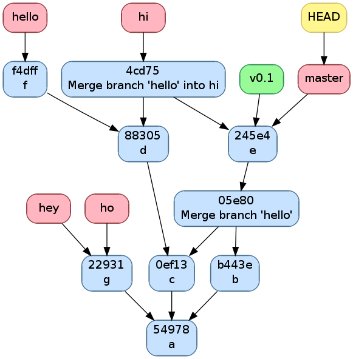

.. -*- coding: utf-8 -*-
.. Copyright |copy| 2013 by Benoit Legat
.. Ce fichier est distribué sous une licence `creative commons <http://creativecommons.org/licenses/by-sa/3.0/>`_

Utilisation non-linéaire de Git
~~~~~~~~~~~~~~~~~~~~~~~~~~~~~~~

`Git`_ peut créer un historique non-linéaire semblable à celui ci-dessous.
C'est un exemple un peu exagéré de non-linéarité mais il est
pédagogiquement intéressant.

Cet historique forme un graphe orienté,
c'est à dire que les arêtes ont une direction.

Les noeuds sont de 3 types,
 - en bleu, on a les commits, c'est comme un snapshot, c'est une
   description complète de l'état de tous les fichiers pris en
   charge par `Git`_ à un moment donné.
   Ces commits sont

    - soit construits comme la version suivante d'un autre commit
      dans lequel cas il y a une seul arête partant du noeud,
    - soit construits comme la fusion de deux commits
      dans lequel cas il y a deux arêtes partant du noeud.

   Ils sont référés par un hash unique dont le début est affiché
   sur la première ligne dans l'image ci-dessous
   et non par un nombre
   comme pour beaucoup d'autres systèmes de gestion de code
   partagé.
   Ils ont aussi un commentaire qui est affiché sur la deuxième ligne,
   une description (optionnelle), un auteur et une date;
 - en rouge, on a les branches, le nom est un peu trompeur car
   c'est juste un pointeur vers un commit.
   On pourrait tout à fait avoir un graphe non-linéaire sans
   utiliser de branches,
   c'est juste plus facile de référer les commits par le nom
   d'une branche qui y réfère plutôt que par un hash sans signification;
 - en vert, ce sont les tags, un tag est comme une branche qui
   ne bouge pas, c'est à dire qu'il réfère toujours vers le même
   commit.
   C'est utile par exemple pour spécifier des versions d'un projet.
 - en jaune, on a ``HEAD``, c'est un pointeur vers la branche active.

   Exemple d'historique.
