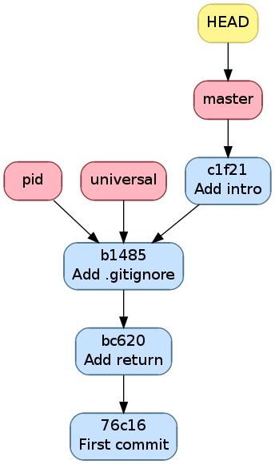

.. -*- coding: utf-8 -*-
.. Copyright |copy| 2013 by Benoit Legat
.. Ce fichier est distribué sous une licence `creative commons <http://creativecommons.org/licenses/by-sa/3.0/>`_

Autres commandes utiles
~~~~~~~~~~~~~~~~~~~~~~~

Afficher l'historique
#####################

Pour afficher l'historique, outre l'outil utilisé pour faire les
illustrations de ce cours que vous pouvez retrouver
`https://github.com/blegat/git-dot <https://github.com/blegat/git-dot>`_,
il existe la commande `git-log(1)`_.
Elle est très flexible comme on va le voir.
``git log`` affiche simplement l'historique à partir de ``HEAD``

.. code-block:: bash

   $ git log
   commit 0dd6cd7e6ecf01b638cd631697bf9690baedcf20
   Merge: eda36d7 6fd2e9b
   Author: Benoît Legat <benoit.legat@gmail.com>
   Date:   Sun Aug 18 15:29:53 2013 +0200

       Merge branch 'universal'

       Conflicts:
           main.c

   commit 6fd2e9bfa199fc3dbca4df87d225e35553d6cd79
   Author: Benoît Legat <benoit.legat@gmail.com>
   Date:   Sun Aug 18 15:06:14 2013 +0200

       Fix SIGSEV without args

   commit eda36d79fd48561dce781328290d40990e74a758
   Author: Benoît Legat <benoit.legat@gmail.com>
   Date:   Sun Aug 18 14:58:29 2013 +0200

       Add pid/ppid info

   ...

Mais on peut aussi demander d'afficher les modifications pour chaque commit
avec l'option ``-p``

.. code-block:: diff

   $ git log -p
   commit 0dd6cd7e6ecf01b638cd631697bf9690baedcf20
   Merge: eda36d7 6fd2e9b
   Author: Benoît Legat <benoit.legat@gmail.com>
   Date:   Sun Aug 18 15:29:53 2013 +0200

       Merge branch 'universal'

       Conflicts:
           main.c

   commit 6fd2e9bfa199fc3dbca4df87d225e35553d6cd79
   Author: Benoît Legat <benoit.legat@gmail.com>
   Date:   Sun Aug 18 15:06:14 2013 +0200

       Fix SIGSEV without args

   diff --git a/main.c b/main.c
   index 8ccfa11..f90b795 100644
   --- a/main.c
   +++ b/main.c
   @@ -9,7 +9,7 @@

    // main function
    int main (int argc, char *argv[]) {

    // main function
    int main (int argc, char *argv[]) {
   -  if (strncmp(argv[1], "--alien", 8) == 0) {
   +  if (argc > 1 && strncmp(argv[1], "--alien", 8) == 0) {
        printf("Hello universe!\n");
      } else {
        printf("Hello world!\n");

   commit eda36d79fd48561dce781328290d40990e74a758
   Author: Benoît Legat <benoit.legat@gmail.com>
   Date:   Sun Aug 18 14:58:29 2013 +0200

       Add pid/ppid info

   diff --git a/main.c b/main.c
   index 8381ce0..b9043af 100644
   --- a/main.c
   +++ b/main.c
   @@ -5,9 +5,11 @@
    // includes
    #include <stdio.h>
    #include <stdlib.h>
   +#include <unistd.h>

    // main function
    int main () {
   +  printf("pid: %u, ppid: %u\n", getpid(), getppid());
      printf("Hello world!\n");
      return EXIT_SUCCESS;
    }

Il existe encore plein d'autres options comme ``--stat`` qui se contente
de lister les fichiers qui ont changés.
En les combinant on peut obtenir des résultats intéressants comme ci-dessous

.. code-block:: bash

   $ git log  --graph --decorate --oneline
   *   0dd6cd7 (HEAD, master) Merge branch 'universal'
   |\
   | * 6fd2e9b Fix SIGSEV without args
   | *   88d2c61 Merge branch 'master' into universal
   | |\
   | * | e0c317a Make it universal
   * | | eda36d7 Add pid/ppid info
   | |/
   |/|
   * | c35a8c3 Add Makefile
   |/
   * c1f2163 Add intro
   * b14855e Add .gitignore
   * bc620ce Add return
   * 76c1677 First commit

On ajoute d'ailleurs souvent un raccourci pour avoir ce graphe avec
``git lol``.

.. code-block:: bash

   $ git config --global alias.lol "log --graph --decorate --oneline"

.. TODO comparer différents commits

.. inginious:: git-log

Sauvegarder des modifications hors de l'historique
##################################################

On a vu que certaines opérations comme `git-checkout(1)`_ nécessitent
de ne pas avoir de modifications en conflit avec l'opération.

`git-stash(1)`_ permet de sauvegarder ces modifications pour qu'elles ne soient
plus dans le *working directory* mais qu'elles ne soient pas perdues.
On peut ensuite les réappliquer avec ``git stash apply`` puis les effacer
avec ``git stash drop``.

Reprenons notre exemple de *Changer la branche active* illustré par la figure
suivante

   Historique après avoir ajouté un commentaire d'introduction

.. code-block:: bash

   $ git checkout pid
   Switched to branch 'pid'
   $ echo "42" >> main.c
   $ echo "42" >> .gitignore
   $ git stash
   Saved working directory and index state WIP on pid: b14855e Add .gitignore
   HEAD is now at b14855e Add .gitignore
   $ git checkout master
   Switched to branch 'master'
   $ git stash apply
   Auto-merging main.c
   # On branch master
   # Changes not staged for commit:
   #   (use "git add <file>..." to update what will be committed)
   #   (use "git checkout -- <file>..." to discard changes in working directory)
   #
   #	modified:   .gitignore
   #	modified:   main.c
   #
   no changes added to commit (use "git add" and/or "git commit -a")

On voit que les changements on été appliqués

.. code-block:: diff

   $ git diff
   diff --git a/.gitignore b/.gitignore
   index cba7efc..5df1452 100644
   --- a/.gitignore
   +++ b/.gitignore
   @@ -1 +1,2 @@
    a.out
   +42
   diff --git a/main.c b/main.c
   index 8381ce0..eefabd7 100644
   --- a/main.c
   +++ b/main.c
   @@ -11,3 +11,4 @@ int main () {
      printf("Hello world!\n");
      return EXIT_SUCCESS;
    }
   +42

On peut alors supprimer le *stash*

.. code-block:: bash

   $ git stash drop
   Dropped refs/stash@{0} (ae5b4fdeb8bd751449d73f955f7727f660708225)

Modifier un commit récent
#########################

Si on a oublié d'ajouter des modifications dans le dernier commit et
qu'on ne l'a pas encore *pushé*, on peut facilement les rajouter.
Il suffit de donner l'option ``--amend`` à `git-commit(1)`_.
Il ajoutera alors les modifications au commit actuel au lieu d'en créer un
nouveau.

On peut aussi annuler le dernier commit avec ``git reset HEAD^``.
`Git`_ permet aussi de construire un commit qui a l'effet inverse d'un autre
avec `git-revert(1)`_.
Ce dernier construit un commit qui annulera l'effet d'un autre commit.
Voyons tout ça par un exemple qui pourrait être le code de *Deep Thought*.

On a un fichier ``main.c`` contenant

.. code-block:: c

   #include <stdio.h>
   #include <stdlib.h>

   int main (int argc, char *argv[]) {
     int *n = (int*) malloc(sizeof(int));
     *n = 42;
     printf("%d\n", *n);
     return EXIT_SUCCESS;
   }

un ``Makefile`` contenant

.. code-block:: makefile

   run: answer
       echo "The answer is `./answer`"

   answer: main.c
       gcc -o answer main.c

si bien qu'on a

.. code-block:: bash

   $ make
   gcc -o answer main.c
   echo "The answer is `./answer`"
   The answer is 42
   $ make
   echo "The answer is `./answer`"
   The answer is 42
   $ touch main.c
   $ make
   gcc -o answer main.c
   echo "The answer is `./answer`"
   The answer is 42

et un fichier ``.gitignore`` avec comme seul ligne ``answer``.

Commençons par committer ``main.c`` et ``.gitignore`` en oubliant le
``Makefile``.

.. code-block:: bash

   $ git init
   Initialized empty Git repository in /path/to_project/.git/
   $ git status
   # On branch master
   #
   # Initial commit
   #
   # Untracked files:
   #   (use "git add <file>..." to include in what will be committed)
   #
   #	.gitignore
   #	Makefile
   #	main.c
   nothing added to commit but untracked files present (use "git add" to track)
   $ git add .gitignore main.c
   $ git commit -m "First commit"
   [master (root-commit) 54e48c9] First commit
    2 files changed, 10 insertions(+)
    create mode 100644 .gitignore
    create mode 100644 main.c
   $ git log --stat --oneline
   54e48c9 First commit
    .gitignore | 1 +
    main.c     | 9 +++++++++
    2 files changed, 10 insertions(+)
   $ git status
   # On branch master
   # Untracked files:
   #   (use "git add <file>..." to include in what will be committed)
   #
   #	Makefile
   nothing added to commit but untracked files present (use "git add" to track)

On pourrait très bien faire un nouveau commit contenant le ``Makefile``
mais si, pour une quelconque raison,
on aimerait l'ajouter dans le commit précédent,
on peut le faire comme suit

.. code-block:: bash

   $ git add Makefile
   $ git commit --amend
   [master 1712853] First commit
    3 files changed, 15 insertions(+)
    create mode 100644 .gitignore
    create mode 100644 Makefile
    create mode 100644 main.c
   $ git log --stat --oneline
   1712853 First commit
    .gitignore | 1 +
    Makefile   | 5 +++++
    main.c     | 9 +++++++++
    3 files changed, 15 insertions(+)

On voit qu'aucun commit n'a été créé mais c'est le commit précédent qui
a été modifié.
Ajoutons maintenant un check de la valeur retournée par `malloc(3)`_ pour gérer
les cas limites

.. code-block:: diff

   $ git diff
   diff --git a/main.c b/main.c
   index 39d64ac..4864e60 100644
   --- a/main.c
   +++ b/main.c
   @@ -3,6 +3,10 @@

    int main (int argc, char *argv[]) {
      int *n = (int*) malloc(sizeof(int));
   +  if (*n == NULL) {
   +    perror("malloc");
   +    return EXIT_FAILURE;
   +  }
      *n = 42;
      printf("%d\n", *n);
      return EXIT_SUCCESS;

et committons le

.. code-block:: bash

   $ git add main.c
   $ git commit -m "Check malloc output"
   [master 9e45e79] Check malloc output
    1 file changed, 4 insertions(+)
   $ git log --stat --oneline
   9e45e79 Check malloc output
    main.c | 4 ++++
    1 file changed, 4 insertions(+)
   1712853 First commit
    .gitignore | 1 +
    Makefile   | 5 +++++
    main.c     | 9 +++++++++
    3 files changed, 15 insertions(+)

Essayons maintenant de construire un commit qui retire les lignes qu'on
vient d'ajouter avec `git-revert(1)`_

.. code-block:: bash

   $ git revert 9e45e79
   [master 6c0f33e] Revert "Check malloc output"
    1 file changed, 4 deletions(-)
   $ git log --stat --oneline
   6c0f33e Revert "Check malloc output"
    main.c | 4 ----
    1 file changed, 4 deletions(-)
   9e45e79 Check malloc output
    main.c | 4 ++++
    1 file changed, 4 insertions(+)
   1712853 First commit
    .gitignore | 1 +
    Makefile   | 5 +++++
    main.c     | 9 +++++++++
    3 files changed, 15 insertions(+)

Le contenu de ``main.c`` est alors

.. code-block:: c

   #include <stdio.h>
   #include <stdlib.h>

   int main (int argc, char *argv[]) {
     int *n = (int*) malloc(sizeof(int));
     *n = 42;
     printf("%d\n", *n);
     return EXIT_SUCCESS;
   }

Comme c'est une bonne pratique de vérifier la valeur de retour de `malloc(3)`_,
supprimons ce dernier commit

.. code-block:: bash

   $ git reset HEAD^
   Unstaged changes after reset:
   M	main.c
   $ git log --oneline
   9e45e79 Check malloc output
   1712853 First commit

.. inginious:: git_catastrophy_scenario_1

.. inginious:: git_catastrophy_scenario_2

.. inginious:: git_catastrophy_scenario_3
